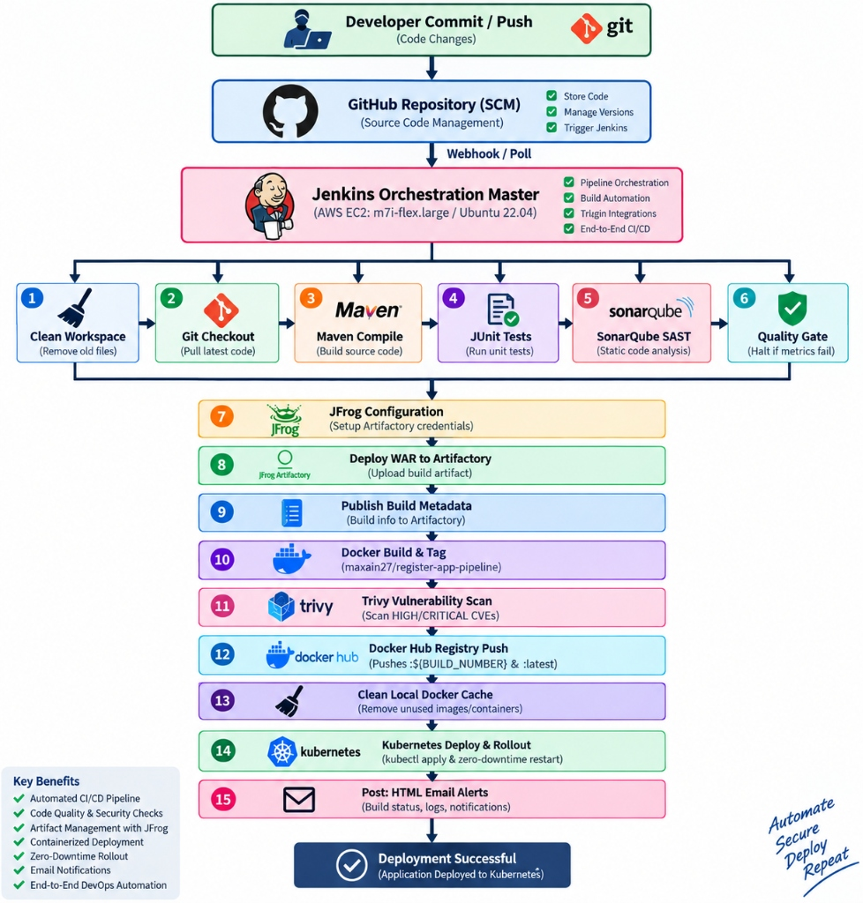

# 🚀 CI/CD Automation Pipeline for Registration App

[](https://www.oracle.com/java/)
[](https://maven.apache.org/)
[](https://www.docker.com/)
[](https://kubernetes.io/)
[](https://www.terraform.io/)
[](https://www.jenkins.io/)
[](https://aquasecurity.github.io/trivy/)
[](https://opensource.org/licenses/MIT)

A production-grade, end-to-end Continuous Integration and Continuous Deployment (CI/CD) pipeline designed to automate the build, test, code quality analysis, artifact storage, vulnerability scanning, containerization, and zero-downtime Kubernetes deployment of a multi-module Java enterprise web application.

---

## 📋 Table of Contents

- [Project Overview](#-project-overview)
- [Architecture & Pipeline Flow](#-architecture--pipeline-flow)
- [Technology Stack](#-technology-stack)
- [Network & Port Architecture](#-network--port-architecture)
- [Repository Structure](#-repository-structure)
- [AWS Cloud Deployment & Architecture](#-aws-cloud-deployment--architecture)
- [Infrastructure Provisioning (Terraform & Cloud-Init)](#-infrastructure-provisioning-terraform--cloud-init)
- [Jenkins Credential Store & Server Configuration](#-jenkins-credential-store--server-configuration)
- [CI/CD Pipeline Stages Deep Dive](#-cicd-pipeline-stages-deep-dive)
- [Kubernetes Zero-Downtime Deployment](#-kubernetes-zero-downtime-deployment)
- [Configuration & Environment Variables](#-configuration--environment-variables)
- [Security, Compliance & Shift-Left Strategy](#-security-compliance--shift-left-strategy)
- [Troubleshooting & Runbook](#-troubleshooting--runbook)
- [Future Enhancements & Roadmap](#-future-enhancements--roadmap)
- [Author & Contributors](#-author--contributors)

---

## 📖 Project Overview

This repository houses the complete DevOps automation framework for the **Registration App** (`regapp`), a multi-module Java application (`server` and `webapp`).

The framework orchestrates an enterprise-ready pipeline utilizing:

- **Jenkins** as the CI/CD pipeline engine.
- **Maven** for compiling, packaging, and dependency resolution.
- **SonarQube** for automated Static Application Security Testing (SAST) and Quality Gate enforcement.
- **JFrog Artifactory** for versioned binary repository management and build trace information.
- **Docker** for packaging into an optimized Apache Tomcat container.
- **Aqua Trivy** for container vulnerability scanning (HIGH and CRITICAL CVE filtering).
- **Kubernetes** for declarative container orchestration with rolling updates.
- **Terraform** for automated AWS cloud infrastructure provisioning (EC2, VPC Security Groups, automated bootstrap).

---

## 🏗 Architecture & Pipeline Flow

<p align="center">
  <a href="images/architecture-pipeline-flow.jpg">
    
  </a>
</p>
<p align="center">
  <em>(Click on the image to view the full-resolution diagram)</em>
</p>


---

## 🛠 Technology Stack

| Domain                     | Technology / Tool                | Version / Spec               | Function in Pipeline                                                    |
| -------------------------- | -------------------------------- | ---------------------------- | ----------------------------------------------------------------------- |
| **Source Language**        | Java (OpenJDK / Eclipse Temurin) | JDK 17                       | Core enterprise application runtime                                     |
| **Build & Packaging**      | Apache Maven                     | 3.8+ / Compiler 3.11.0       | Multi-module compilation, dependency lifecycle, WAR artifact generation |
| **App Server Container**   | Apache Tomcat                    | Latest Official Base         | Web runtime serving `webapp.war` on port 8080                           |
| **Continuous Integration** | Jenkins                          | LTS (Declarative Pipeline)   | Pipeline orchestration, job automation, email alerting                  |
| **Static Code Analysis**   | SonarQube Community              | LTS Container (port 9000)    | SAST, code smell detection, test coverage validation, Quality Gates     |
| **Artifact Management**    | JFrog Artifactory                | OSS / Enterprise (8081/8082) | Centralized release & snapshot binary storage (`libs-release-local`)    |
| **Containerization**       | Docker Engine                    | 24.x+                        | Image build, tag immutability, daemon execution                         |
| **Image Security**         | Aqua Security Trivy              | Latest CLI                   | Vulnerability scanner for container base images and application layers  |
| **Image Registry**         | Docker Hub                       | Public / Private             | Secure container image registry storage                                 |
| **Orchestration**          | Kubernetes (Kubeconfig CLI)      | v1.26+                       | Pod scheduling, service load balancing, rolling deployment execution    |
| **Infrastructure as Code** | Terraform                        | HashiCorp AWS ~> 5.0         | Declarative AWS EC2 instance, security groups, and cloud-init bootstrap |
| **Cloud Provider**         | Amazon Web Services (AWS)        | Region `ap-south-2`          | Cloud host for Jenkins, SonarQube, Artifactory VM                       |

---

## 🌐 Network & Port Architecture

The infrastructure provisioned via Terraform (`main.tf`) opens ingress firewall rules for the following components:

| Port   | Protocol | Service / Component    | Purpose                                           | Access Scope         |
| ------ | -------- | ---------------------- | ------------------------------------------------- | -------------------- |
| `22`   | TCP      | SSH (OpenSSH)          | Remote administration & server debugging          | Admin / Bastion      |
| `80`   | TCP      | HTTP Reverse Proxy     | Web ingress traffic                               | Public / Ingress     |
| `443`  | TCP      | HTTPS (TLS)            | Secure web traffic & SSL offloading               | Public / Ingress     |
| `8080` | TCP      | Jenkins & Tomcat       | Jenkins Web UI & Tomcat App runtime               | CI/CD Agents / Users |
| `9000` | TCP      | SonarQube Server       | Code analysis metrics, web dashboard, webhook     | Pipeline / Team      |
| `3000` | TCP      | Monitoring Dashboard   | Optional Grafana / Node monitoring dashboard      | Admin / Monitoring   |
| `8081` | TCP      | JFrog Artifactory REST | Artifactory REST API, download & upload endpoints | Maven / Pipeline     |
| `8082` | TCP      | JFrog Web Platform     | JFrog modern unified web platform UI              | Admin / Browser      |

---

## 📁 Repository Structure

```text
CI-CD-AUTOMATION/
├── .gitignore                      # Git exclusion rules (targets, class files, local keys)
├── Dockerfile                      # Multi-stage optimized Tomcat container definition
├── Jenkinsfile                     # Declarative CI/CD pipeline script (14 stages + email post)
├── README.md                       # Comprehensive project documentation
├── pom.xml                         # Root Maven reactor POM (modules: server, webapp)
├── token.txt                       # Local placeholder for development tokens (keep excluded)
├── Kubernete/                      # Kubernetes deployment & networking specifications
│   ├── regapp-deploy.yml           # Deployment manifest (replicas: 2, RollingUpdate strategy)
│   └── regapp-service.yml          # LoadBalancer Service exposing Pods on port 8080
├── Terraform/                      # Infrastructure as Code (IaC) configuration
│   ├── main.tf                     # EC2 instance (m7i-flex.large) & Security Group definitions
│   ├── provider.tf                 # AWS Provider configuration (region: ap-south-2)
│   ├── install.sh                  # User-data bootstrap script (Docker, Jenkins, Java 17, Trivy)
│   ├── system.yaml                 # JFrog Artifactory system configuration template
│   └── .terraform.lock.hcl         # Terraform provider lockfile for reproducible plans
├── server/                         # Server backend logic module
│   ├── pom.xml                     # Submodule POM (JAR packaging)
│   └── src/                        # Java source code and unit tests
└── webapp/                         # Web frontend / servlet module
    ├── pom.xml                     # Submodule POM (WAR packaging, Jetty plugin)
    └── src/                        # Web application source, JSP, web.xml
```

---

## ☁️ AWS Cloud Deployment & Architecture

This application and its supporting pipeline run end-to-end on **Amazon Web Services (AWS)** using cloud infrastructure rather than local hosting.

### 1. Cloud Build & Automation Flow
- **AWS EC2 Pipeline Host (`m7i-flex.large`)**: Runs the Jenkins master, Maven build engine, SonarQube container, and Trivy scanner in the AWS `ap-south-2` region.
- **Continuous Integration**: When commits are pushed to the GitHub repository, Jenkins compiles the code in the cloud, executes tests, and publishes versioned WAR artifacts to JFrog Artifactory (`http://16.112.180.109:8082/artifactory`).
- **Container Registry**: Packages the application into an Apache Tomcat container image and pushes it to Docker Hub (`maxain27/register-app-pipeline`).

### 2. AWS Kubernetes Deployment & Cloud Networking
- **Kubernetes Pods**: Deploys 2 Pod replicas across worker nodes with `RollingUpdate` zero-downtime policy.
- **AWS Cloud LoadBalancer Service**: Exposes the application externally via Kubernetes Service (`type: LoadBalancer`), binding external port `8080` to the Tomcat container port `8080`.

### 3. Accessing Application & Services on AWS Cloud
The live endpoints are accessed directly via AWS public IPs and LoadBalancer DNS endpoints:

| Service / Endpoint | Cloud URL / Access Path | Description |
| ------------------ | ----------------------- | ----------- |
| **Registration Web App** | `http://<AWS-LOADBALANCER-DNS>:8080/webapp/` | Production application URL via AWS LoadBalancer |
| **Jenkins Dashboard** | `http://<AWS-EC2-PUBLIC-IP>:8080` | CI/CD pipeline management & build monitoring |
| **SonarQube Dashboard** | `http://<AWS-EC2-PUBLIC-IP>:9000` | Code quality gates, security vulnerabilities & metrics |
| **JFrog Artifactory** | `http://<AWS-EC2-PUBLIC-IP>:8082` | Binary repository management & build metadata |

---

## ☁️ Infrastructure Provisioning (Terraform & Cloud-Init)

The `Terraform/` directory provisions an AWS EC2 instance running Ubuntu 22.04 with automated configuration for the entire CI/CD toolchain.

### Provisioning Steps

```bash
cd Terraform

# Initialize providers and lockfiles
terraform init

# Validate configuration syntax
terraform validate

# Review proposed changes
terraform plan

# Provision resources
terraform apply -auto-approve
```

### What `install.sh` (User-Data) Configures Automatically:

When the EC2 instance launches, `install.sh` automatically installs and configures:

1. **Eclipse Temurin JDK 17** via official Adoptium APT repository.
2. **Jenkins LTS**: Adds GPG keyring, installs daemon, starts `jenkins` systemd service.
3. **Docker Engine**: Installs `docker.io`, assigns Docker socket access to both `ubuntu` and `jenkins` users (`usermod -aG docker jenkins`).
4. **SonarQube Container**: Automatically pulls and spins up `sonarqube:lts-community` bound to port `9000:9000`.
5. **Aqua Trivy**: Installs the Aqua Security Trivy Debian package for instant CLI scanning.
6. **Apache Maven**: Installs Maven for local agent builds.

### First-Time Access:

Retrieve the initial Jenkins unlock password from the server:

```bash
ssh -i <your-key.pem> ubuntu@<EC2_PUBLIC_IP>
sudo cat /var/lib/jenkins/secrets/initialAdminPassword
```

---

## 🔑 Jenkins Credential Store & Server Configuration

To execute the `Jenkinsfile` seamlessly, configure the following entries in **Jenkins** ➔ **Manage Jenkins** ➔ **Credentials** ➔ **System** ➔ **Global credentials**:

| Credential ID       | Kind                                  | Used By Stage                         | Description                                                             |
| ------------------- | ------------------------------------- | ------------------------------------- | ----------------------------------------------------------------------- |
| `github-token-auth` | Secret text or Username with password | `Checkout from SCM`                   | GitHub Personal Access Token (with `repo` scope)                        |
| `SonarQube-Token`   | Secret text                           | `SonarQube Analysis` & `Quality Gate` | Authentication token generated from SonarQube (`My Account > Security`) |
| `jfrog`             | Username with password                | `Artifactory Configuration`           | JFrog Artifactory user credentials for Maven resolution & deployment    |
| `dockerhub`         | Username with password                | `Build & Push Docker Image`           | Docker Hub registry credentials (`maxain27`)                            |
| `kubernetes`        | Secret file                           | `Deploy to Kubernetes`                | Valid `kubeconfig` cluster configuration file                           |

### Global Tool & Plugin Setup:

- **Maven**: Go to _Manage Jenkins_ ➔ _Tools_ ➔ _Maven installations_. Add an entry named **`Maven`** (matching `tools { maven 'Maven' }` in `Jenkinsfile`).
- **SonarQube Server**: Go to _Manage Jenkins_ ➔ _System_ ➔ _SonarQube servers_. Add an instance pointing to `http://<IP>:9000` using the `SonarQube-Token`.
- **SonarQube Webhook**: In SonarQube (_Administration > Configuration > Webhooks_), create a webhook targeting:
  ```text
  http://<JENKINS_URL>:8080/sonarqube-webhook/
  ```
  _(This is mandatory for `waitForQualityGate` to receive instant callbacks without hanging)._
- **Email Notification**: Under _Manage Jenkins_ ➔ _System_ ➔ _Extended E-mail Notification_, set SMTP host, port (e.g., 465/587), and authentication credentials.

---

## ⚙️ CI/CD Pipeline Stages Deep Dive

Each stage in `Jenkinsfile` is engineered for reliability, traceability, and failure isolation:

```groovy
// Key Pipeline Configuration Snippet
pipeline {
    agent any
    tools { maven 'Maven' }
    environment {
        APP_NAME     = "register-app-pipeline"
        RELEASE      = "1.0.0"
        IMAGE_NAME   = "maxain27/register-app-pipeline"
        IMAGE_TAG    = "${RELEASE}-${BUILD_NUMBER}"
        // ...
    }
    // ...
}
```

1. **Cleanup Workspace (`cleanWs`)**: Clears stale artifacts, previous checkout files, and temporary test directories to guarantee hermetic builds.
2. **Checkout from SCM**: Fetches the `main` branch from GitHub using token-backed authentication.
3. **Build Application**: Runs `mvn clean package` on the reactor project, producing `server/target/server.jar` and `webapp/target/webapp.war`.
4. **Test Application**: Executes all JUnit tests via `mvn test`. If any unit test fails, the build halts immediately.
5. **SonarQube Analysis**: Runs static analysis using the Maven Sonar plugin (`mvn sonar:sonar`), publishing code metrics, duplicate line analysis, and vulnerability reports to the SonarQube server.
6. **Quality Gate (`waitForQualityGate`)**: Pauses the pipeline to receive quality gate status from SonarQube. Halts execution if security ratings, coverage, or code smell thresholds are violated.
7. **Artifactory Configuration**: Initializes JFrog connection properties via the Jenkins JFrog plugin, establishing resolution and deployment targets for Maven artifacts.
8. **Deploy Artifacts (`rtMavenRun`)**: Deploys the built `webapp.war` to `libs-release-local` or `libs-snapshot-local` in JFrog Artifactory.
9. **Publish Build Info (`rtPublishBuildInfo`)**: Collects environment variables, dependencies, Git commit SHA, and build numbers and publishes the metadata bundle to Artifactory.
10. **Build & Push Docker Image**:
    - Generates container image tagged with `${RELEASE}-${BUILD_NUMBER}` and `latest`.
    - Authenticates to Docker Hub via `docker.withRegistry` and pushes both tags.
11. **Trivy Vulnerability Scan**: Executes container scan via Docker socket binding:
    ```bash
    docker run --rm -v /var/run/docker.sock:/var/run/docker.sock \
      aquasec/trivy image maxain27/register-app-pipeline:latest \
      --no-progress --scanners vuln --severity HIGH,CRITICAL --format table
    ```
12. **Cleanup Artifacts**: Removes locally built Docker images (`docker rmi`) to prevent disk bloat on the Jenkins build agent.
13. **Deploy to Kubernetes**:
    - Navigates to `Kubernete/` directory.
    - Applies `regapp-deploy.yml` and `regapp-service.yml` using `kubeconfig`.
    - Triggers an automated zero-downtime rolling update via `kubectl rollout restart deployment.apps/regapp-deployment`.
14. **Post Actions (Notification)**: Dispatches customized HTML emails (`groovy-html.template`) indicating build success or failure with direct links to the build log.

---

## ☸️ Kubernetes Zero-Downtime Deployment

The Kubernetes manifests in the `Kubernete/` directory manage runtime orchestration.

### Deployment (`regapp-deploy.yml`)

- **Replicas**: 2 Pod instances for high availability.
- **Image**: `maxain27/register-app-pipeline` with `imagePullPolicy: Always`.
- **Strategy**: `RollingUpdate` with `maxSurge: 1` and `maxUnavailable: 1`. This ensures at least 1 Pod remains healthy and serving traffic while new pods are progressively launched and tested.

### Service (`regapp-service.yml`)

- **Type**: `LoadBalancer` (provisions cloud load balancer on AWS/GCP or works with MetalLB on-prem).
- **Port Mapping**: Exposes external port `8080` targeting container port `8080`.

### Manual Cluster Verification:

```bash
# Check pod status and replicas
kubectl get pods -l app=regapp -o wide

# Check service endpoint and external IP
kubectl get svc regapp-service

# Watch rollout progression
kubectl rollout status deployment/regapp-deployment

# View live application logs
kubectl logs -l app=regapp --tail=100 -f
```

---

## ⚙️ Configuration & Environment Variables

Key pipeline configurations are governed by variables defined in the `Jenkinsfile`:

| Variable             | Current Default                          | Recommended Action for Production                                  |
| -------------------- | ---------------------------------------- | ------------------------------------------------------------------ |
| `APP_NAME`           | `register-app-pipeline`                  | Adjust according to your microservice naming standard              |
| `RELEASE`            | `1.0.0`                                  | Increment on semantic release versions (e.g., `1.1.0`)             |
| `DOCKER_USER`        | `maxain27`                               | Change to your Docker Hub username or organization registry        |
| `DOCKER_CRED_ID`     | `dockerhub`                              | ID of Docker credentials saved in Jenkins store                    |
| `SONAR_HOST_URL`     | `http://16.112.180.109:9000`             | Replace with permanent DNS (e.g., `https://sonar.internal.domain`) |
| `JFROG_URL`          | `http://16.112.180.109:8082/artifactory` | Replace with permanent Artifactory DNS endpoint                    |
| `NOTIFICATION_EMAIL` | `shaikhmazz125@gmail.com`                | Update to the team DL or on-call notification list                 |

---

## 🔒 Security, Compliance & Shift-Left Strategy

1. **Zero Hardcoded Secrets**: All tokens, API keys, Docker passwords, and kubeconfig credentials are injected at runtime via Jenkins credential masking plugins.
2. **Shift-Left SAST**: Static code analysis runs before artifacts are promoted to JFrog or Docker Hub, catching SQL injection risks, insecure dependencies, and memory leaks before containerization.
3. **Artifact Immutability**: Every build produces an immutable Docker tag (`${RELEASE}-${BUILD_NUMBER}`) matching the exact binary in JFrog Artifactory, enabling precise rollbacks.
4. **Vulnerability Gating**: Aqua Trivy scans container base layers and libraries for known Common Vulnerabilities and Exposures (CVEs) rated `HIGH` or `CRITICAL`.
5. **Least-Privilege Isolation**: Containers run independently within isolated Kubernetes namespaces with restricted port bindings.

---

## 🩺 Troubleshooting & Runbook

### 1. `docker: Got permission denied while trying to connect to the Docker daemon socket`

- **Cause**: Jenkins user does not have permission to access `/var/run/docker.sock`.
- **Remedy**:
  ```bash
  sudo usermod -aG docker jenkins
  sudo chmod 666 /var/run/docker.sock
  sudo systemctl restart jenkins
  ```

### 2. `waitForQualityGate` Times Out or Hangs

- **Cause**: SonarQube webhook is either not configured or unable to reach Jenkins back on port 8080.
- **Remedy**:
  - Verify in SonarQube: _Administration > Configuration > Webhooks_.
  - Test connectivity from SonarQube host to Jenkins:
    ```bash
    curl -I http://<JENKINS_IP>:8080/sonarqube-webhook/
    ```

### 3. Maven Build Fails with `Missing / Empty web.xml`

- **Cause**: WAR plugin requires `web.xml` by default in servlet projects.
- **Remedy**: Configured in root `pom.xml` with `<failOnMissingWebXml>false</failOnMissingWebXml>`. Ensure this property is preserved.

### 4. Kubernetes `ImagePullBackOff` or `ErrImagePull`

- **Cause**: Private repository authentication failure or wrong image tag name.
- **Remedy**:
  - Verify image name in `regapp-deploy.yml`.
  - Ensure cluster has Docker Hub credentials secret configured (`imagePullSecrets`).

---

## 🚀 Future Enhancements & Roadmap

- [ ] **AWS EKS Integration**: Transition from standalone EC2/Kubernetes to automated Amazon EKS provisioning using Terraform modules.
- [ ] **Helm Chart Packaging**: Package Kubernetes deployment and service manifests into versioned Helm charts.
- [ ] **GitOps with ArgoCD**: Decouple deployment from Jenkins by implementing continuous GitOps synchronization with ArgoCD.
- [ ] **DAST Integration**: Incorporate OWASP ZAP dynamic security scans post-deployment in a staging namespace.
- [ ] **Observability Stack**: Deploy Prometheus and Grafana dashboards for cluster and application performance monitoring.

---

## 👤 Author & Contributors

- **Shaikh Mazein Ahmed**
  - GitHub: [@shaikhmazz](https://github.com/shaikhmazz)
  - Project Repository: [CI-CD-AUTOMATION](https://github.com/shaikhmazz/CI-CD-AUTOMATION)

---

## 📄 License

This project is licensed under the [MIT License](https://opensource.org/licenses/MIT). You are free to use, modify, and distribute this software for personal or commercial projects.
